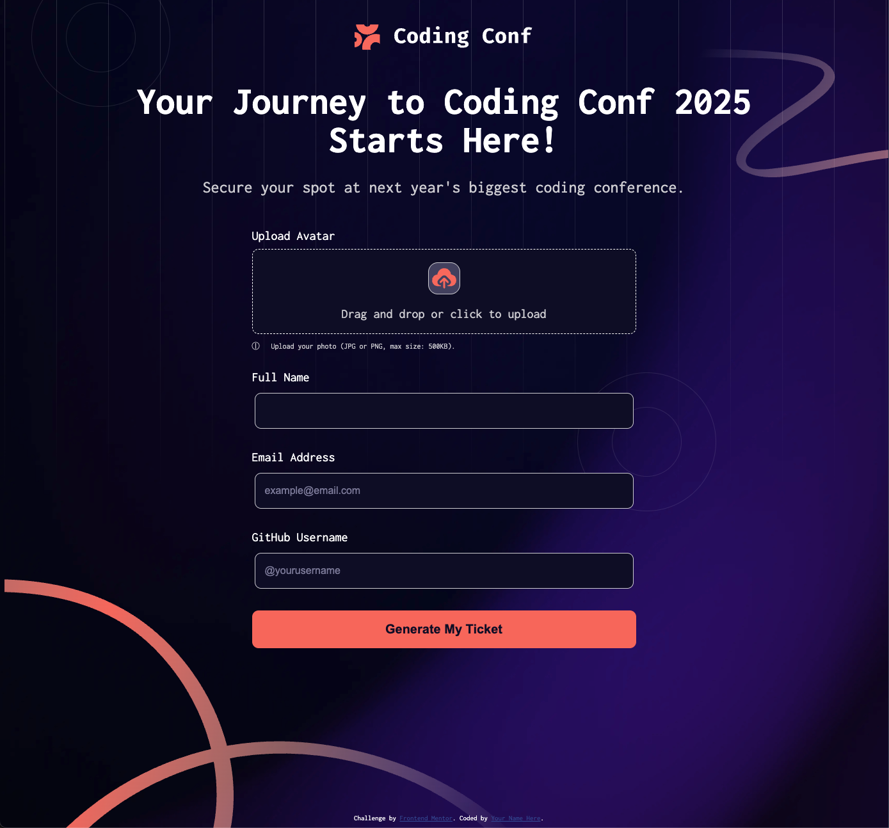

# Frontend Mentor - Conference ticket generator solution

This is a solution to the [Conference ticket generator challenge on Frontend Mentor](https://www.frontendmentor.io/challenges/conference-ticket-generator-oq5gFIU12w). Frontend Mentor challenges help you improve your coding skills by building realistic projects. 

## Table of contents

- [Overview](#overview)
  - [The challenge](#the-challenge)
  - [Screenshot](#screenshot)
  - [Links](#links)
- [My process](#my-process)
  - [Built with](#built-with)
  - [What I learned](#what-i-learned)
  - [Continued development](#continued-development)
- [Author](#author)

## Overview

### The challenge

Users should be able to:

- Complete the form with their details
- Receive form validation messages if:
  - Any field is missed
  - The email address is not formatted correctly
  - The avatar upload is too big or the wrong image format
- Complete the form only using their keyboard
- Have inputs, form field hints, and error messages announced on their screen reader
- See the generated conference ticket when they successfully submit the form
- View the optimal layout for the interface depending on their device's screen size
- See hover and focus states for all interactive elements on the page

### Screenshot

### Links

- Solution URL: [Source code](https://your-solution-url.com)
- Live Site URL: [Live Site](https://hanifmaleki.github.io/Conference-Ticket/)

## My process

I started by analyzing the project design and identifying the required HTML structure. Then, I created the basic layout using semantic HTML and applied styles using CSS custom properties. I used Flexbox and Grid to handle layout responsiveness. Finally, I implemented form behavior and validation using JavaScript.

### Built with

- Semantic HTML5 markup
- CSS custom properties
- Flexbox
- CSS Grid

### What I learned

In this project, I practiced creating accessible forms and handling validation manually using JavaScript. I reinforced my understanding of the addEventListener method, input field event handling, and custom error messages. On the styling side, I improved my use of Flexbox and CSS Grid to create responsive designs.

### Continued development

In the next project, I plan to use SCSS to better manage styles and variables. I will also experiment with a lightweight HTML templating engine to keep my code more modular and organized.

## Author

- Frontend Mentor - [@hanifmaleki](https://www.frontendmentor.io/profile/hanifmaleki)
